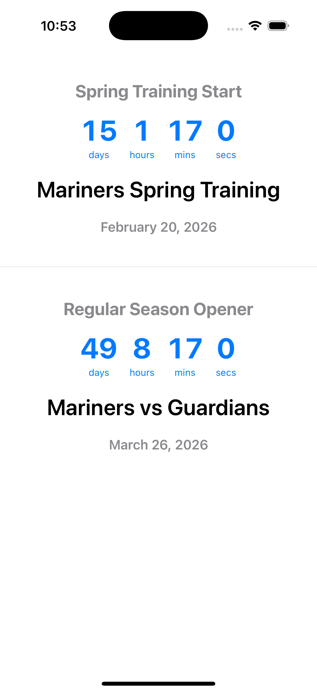
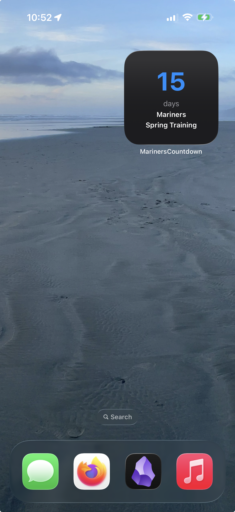

# Mariners Countdown Widget

iOS app with home screen widget showing countdowns to key Mariners games in the 2026 season.

| App Main Screen | Home Screen Widget |
| :---: | :---: |
|  |  |

## Features

- **Dual Countdown**: Track both the Spring Training opener and the Regular Season Opener.
- **High Precision**: The app displays days, hours, minutes, and seconds in real-time.
- **Home Screen Widget**: A simple, glanceable widget showing days remaining until the next big game.
- **Custom Branding**: Features a custom-generated Mariners "S" logo and team colors (#005C5C and monospaced typography).
- **Timezone Aware**: Handles Pacific Time correctly for all game starts.

## Countdown Targets

1. **Spring Training Opener**: February 20, 2026, 12:10 PM PT.
2. **Regular Season Opener**: Mariners vs Guardians, March 26, 2026, 7:10 PM PT.

## Setup

1. **Open in Xcode**
   ```bash
   open MarinersCountdown.xcodeproj
   ```

2. **Configure Code Signing**
   - Select the "MarinersCountdown" project in the navigator.
   - Select "MarinersCountdown" target.
   - Go to "Signing & Capabilities".
   - Set your Team (requires Apple Developer account).
   - Xcode will automatically update the bundle identifier if needed.
   - Repeat for "MarinersWidgetExtension" target.

3. **Connect Your iPhone**
   - Connect your iPhone via USB.
   - Unlock the device and trust your computer if prompted.

4. **Build and Run**
   - Click the Run button (▶) or press Cmd+R.
   - The app will install on your iPhone.

## Using the Widget

1. Long-press on your home screen.
2. Tap the "+" button in the top-left corner.
3. Search for "Mariners".
4. Select "Mariners Countdown" and choose the small widget size.
5. Tap "Add Widget".

## Project Structure

- `MarinersCountdown/` - Main iOS app with high-precision countdowns.
- `MarinersWidget/` - Widget extension for the home screen.
- `Shared/` - Shared countdown logic and calculator.
- `generate_icon.swift` - Script used to generate the custom app icon.

## Requirements

- iOS 17.0 or later
- Xcode 15.0 or later
- Apple Developer account for device installation
